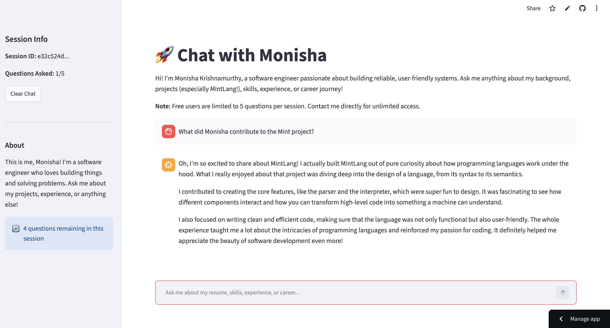

# Portfolio Chatbot

A conversational interface for exploring my background, skills, and projects. The repository includes a Streamlit application and a separate Gradio implementation with semantic retrieval.

**Stack:** Python · OpenAI API · Streamlit · SQLite · NumPy · scikit-learn

[Hosted app](https://monisha-portfolio-chatbot.streamlit.app/)

## Preview



## How the Streamlit application works

1. Checks SQLite for an exact-match cached answer.
2. Uses `me/summary2.txt` as background context for an OpenAI response when no cached answer exists.
3. Saves the question and answer in SQLite for subsequent requests.
4. Displays messages and counts questions within the current Streamlit session.

The interface limits ordinary sessions to five questions. Clearing the chat retains that counter. An app-wide server-side quota also limits uncached API requests across sessions.

## Run locally

```bash
git clone https://github.com/monisha-krishnamurthy/portfolio-chatbot.git
cd portfolio-chatbot
python3 -m venv .venv
source .venv/bin/activate
python -m pip install -r requirements.txt
```

Create a local `.env` file containing your own key:

```dotenv
OPENAI_API_KEY=your_openai_api_key_here
```

```bash
streamlit run streamlit_app.py
```

Alternatively, configure `OPENAI_API_KEY` in `.streamlit/secrets.toml` or the deployment's Streamlit secrets. Keep secrets out of version control. API use may incur charges.

## Repository guide

- `streamlit_app.py`: Streamlit interface and summary-based response generation.
- `database.py`: SQLite initialization, answer caching, and session helpers.
- `resume_bot.py`: separate Gradio implementation with embedding-based retrieval and tool calls.
- `embeddings.py` and `search.py`: embedding and search utilities.
- `me/`: resume PDF, background text, GitHub profile text, and stored embeddings.

## Implementation notes

The Streamlit entry point currently returns the background summary from `get_relevant_context()`; it does not perform semantic retrieval. It displays conversation history but sends only the current question and background context to the model.

The Gradio implementation has additional requirements, including Gradio and Hugging Face configuration, and is not covered by the Streamlit quick start. Its token debug print should be removed before running with real credentials.

Questions and generated answers are stored locally in `me/db.sqlite`; they are not confined to browser session memory. Background context and uncached questions are sent to OpenAI. The resume and text files under `me/` are public repository content.

Generated responses can be inaccurate. Update the source material when your background changes and review the app's answers before using them professionally.

## Demo usage controls

Each deployment allows at most **5 uncached AI requests per rolling minute** and
**50 per rolling 24 hours**, shared across all visitors. Requests are reserved
atomically in SQLite before calling the provider; failed attempts count too.
Automatic provider retries are disabled. Cached results do not consume this quota.
AI responses are capped at **500 output tokens**.

Counters survive browser refreshes and clearing chat, but may reset when hosting
replaces the local filesystem. Separate instances have separate counters. These
controls reduce usage; they are not a hard dollar cap or per-person authentication.
